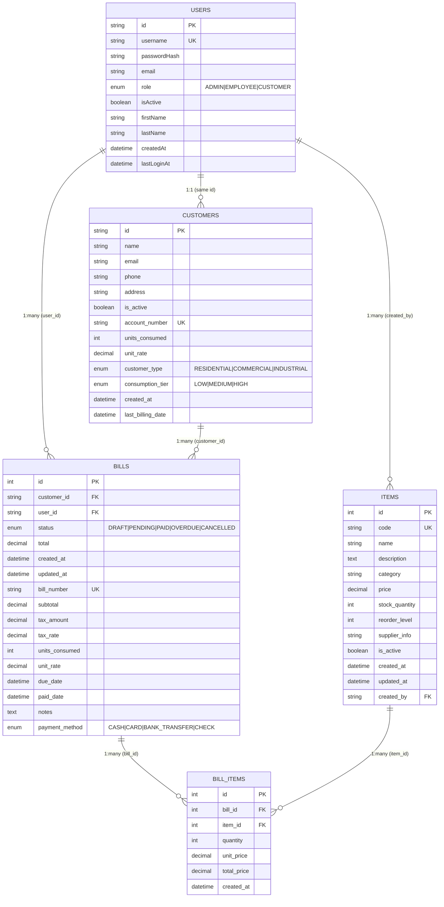
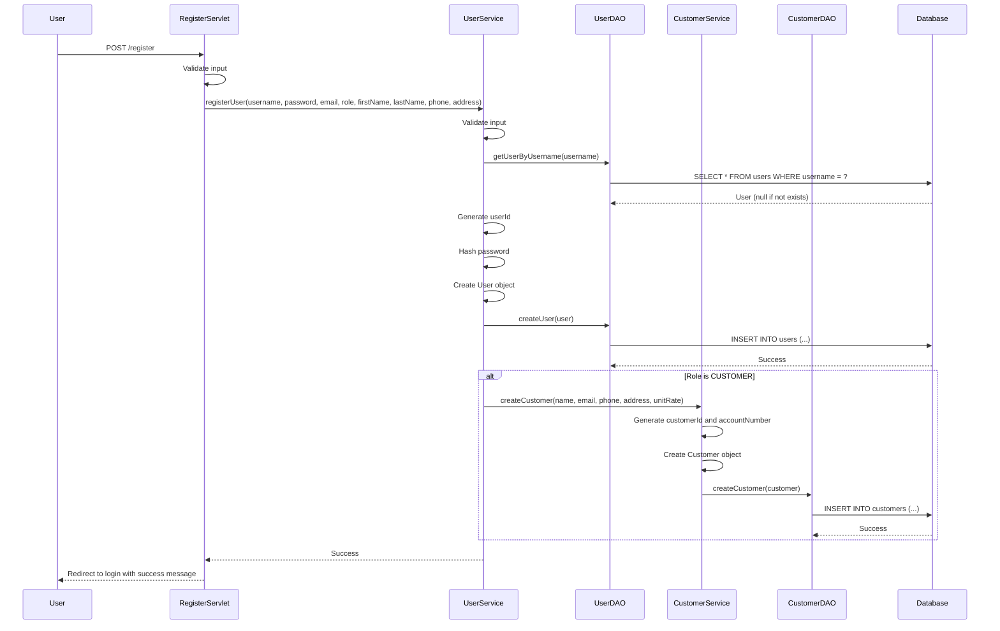
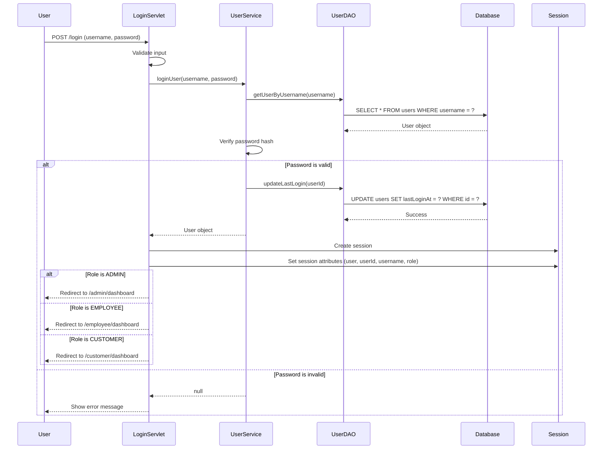
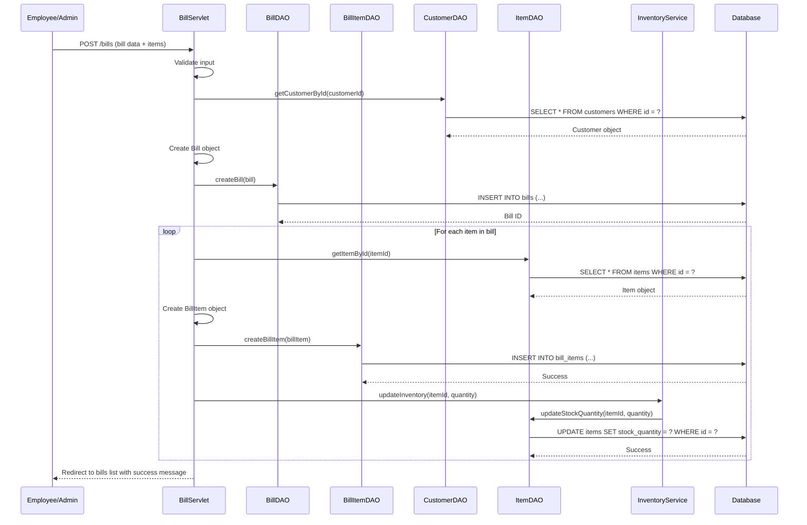
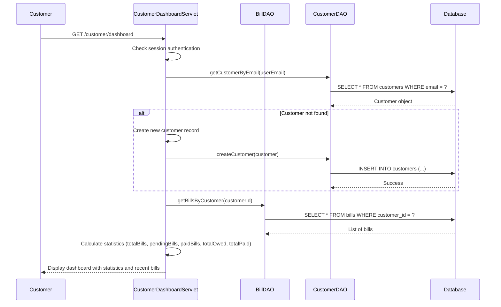
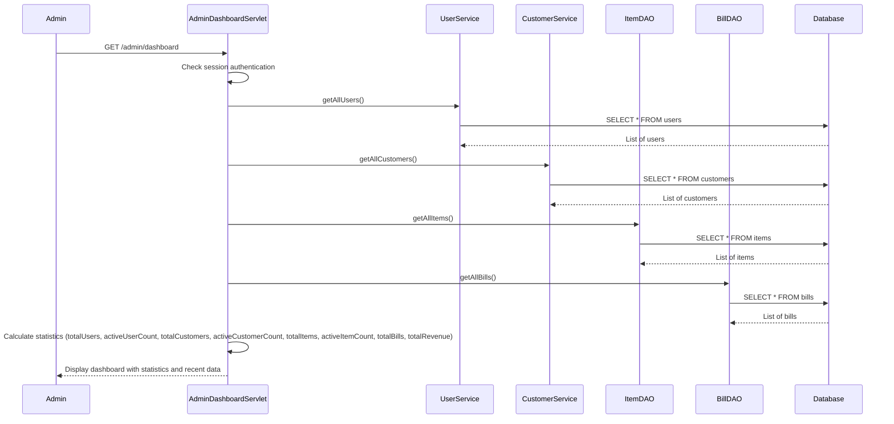
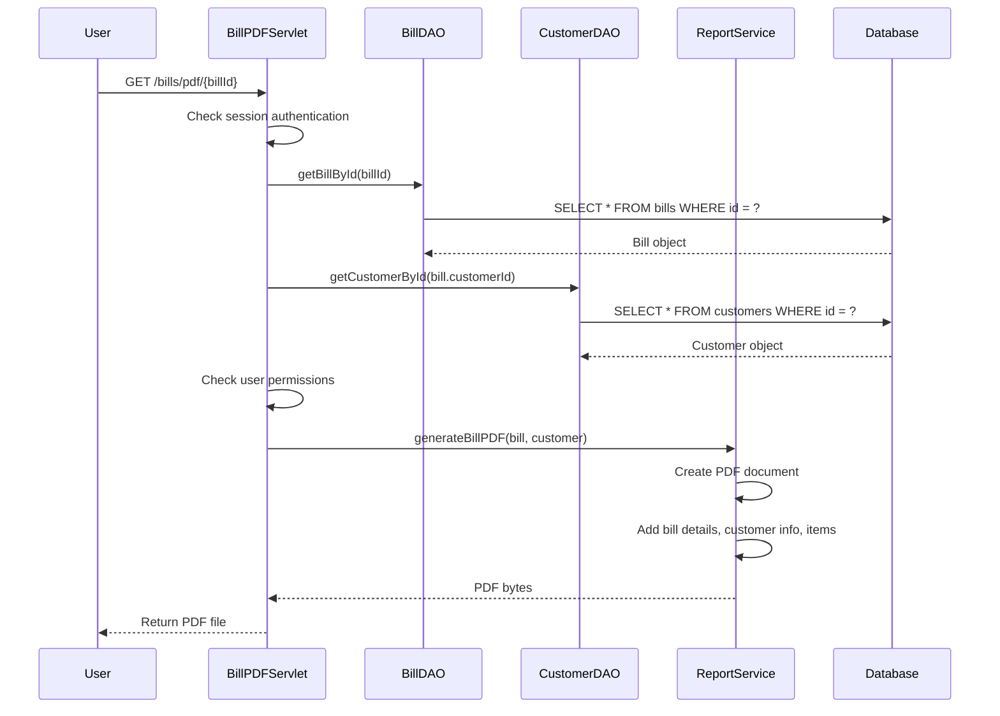

# 📊 Pahana Smart Bill - System Diagrams

## 🗄️ Entity Relationship (ER) Diagram

## 🏗️ Class Diagram

```mermaid
classDiagram
    %% Model Classes
    class User {
        -String id
        -String username
        -String passwordHash
        -String email
        -String role
        -boolean isActive
        -String firstName
        -String lastName
        -Date createdAt
        -Date lastLoginAt
        +getId() String
        +setId(String id) void
        +getUsername() String
        +setUsername(String username) void
        +getPasswordHash() String
        +setPasswordHash(String passwordHash) void
        +getEmail() String
        +setEmail(String email) void
        +getRole() String
        +setRole(String role) void
        +isActive() boolean
        +setActive(boolean isActive) void
        +getFirstName() String
        +setFirstName(String firstName) void
        +getLastName() String
        +setLastName(String lastName) void
        +getCreatedAt() Date
        +setCreatedAt(Date createdAt) void
        +getLastLoginAt() Date
        +setLastLoginAt(Date lastLoginAt) void
    }
    
    class Customer {
        -String id
        -String name
        -String email
        -String phone
        -String address
        -boolean isActive
        -String accountNumber
        -int unitsConsumed
        -double unitRate
        -String customerType
        -String consumptionTier
        -Date createdAt
        -Date lastBillingDate
        +getId() String
        +setId(String id) void
        +getName() String
        +setName(String name) void
        +getEmail() String
        +setEmail(String email) void
        +getPhone() String
        +setPhone(String phone) void
        +getAddress() String
        +setAddress(String address) void
        +isActive() boolean
        +setActive(boolean isActive) void
        +getAccountNumber() String
        +setAccountNumber(String accountNumber) void
        +getUnitsConsumed() int
        +setUnitsConsumed(int unitsConsumed) void
        +getUnitRate() double
        +setUnitRate(double unitRate) void
        +getCustomerType() String
        +setCustomerType(String customerType) void
        +getConsumptionTier() String
        +setConsumptionTier(String consumptionTier) void
        +getCreatedAt() Date
        +setCreatedAt(Date createdAt) void
        +getLastBillingDate() Date
        +setLastBillingDate(Date lastBillingDate) void
        +generateAccountNumber() void
        +calculateUnitRate() void
    }
    
    class Item {
        -int id
        -String code
        -String name
        -String description
        -String category
        -double price
        -int stockQuantity
        -int reorderLevel
        -String supplierInfo
        -boolean isActive
        -Date createdAt
        -Date updatedAt
        -String createdBy
        +getId() int
        +setId(int id) void
        +getCode() String
        +setCode(String code) void
        +getName() String
        +setName(String name) void
        +getDescription() String
        +setDescription(String description) void
        +getCategory() String
        +setCategory(String category) void
        +getPrice() double
        +setPrice(double price) void
        +getStockQuantity() int
        +setStockQuantity(int stockQuantity) void
        +getReorderLevel() int
        +setReorderLevel(int reorderLevel) void
        +getSupplierInfo() String
        +setSupplierInfo(String supplierInfo) void
        +isActive() boolean
        +setActive(boolean isActive) void
        +getCreatedAt() Date
        +setCreatedAt(Date createdAt) void
        +getUpdatedAt() Date
        +setUpdatedAt(Date updatedAt) void
        +getCreatedBy() String
        +setCreatedBy(String createdBy) void
        +generateItemCode() void
    }
    
    class Bill {
        -int id
        -String customerId
        -String userId
        -String status
        -double total
        -Date createdAt
        -Date updatedAt
        -String billNumber
        -double subtotal
        -double taxAmount
        -double taxRate
        -int unitsConsumed
        -double unitRate
        -Date dueDate
        -Date paidDate
        -String notes
        -String paymentMethod
        +getId() int
        +setId(int id) void
        +getCustomerId() String
        +setCustomerId(String customerId) void
        +getUserId() String
        +setUserId(String userId) void
        +getStatus() String
        +setStatus(String status) void
        +getTotal() double
        +setTotal(double total) void
        +getCreatedAt() Date
        +setCreatedAt(Date createdAt) void
        +getUpdatedAt() Date
        +setUpdatedAt(Date updatedAt) void
        +getBillNumber() String
        +setBillNumber(String billNumber) void
        +getSubtotal() double
        +setSubtotal(double subtotal) void
        +getTaxAmount() double
        +setTaxAmount(double taxAmount) void
        +getTaxRate() double
        +setTaxRate(double taxRate) void
        +getUnitsConsumed() int
        +setUnitsConsumed(int unitsConsumed) void
        +getUnitRate() double
        +setUnitRate(double unitRate) void
        +getDueDate() Date
        +setDueDate(Date dueDate) void
        +getPaidDate() Date
        +setPaidDate(Date paidDate) void
        +getNotes() String
        +setNotes(String notes) void
        +getPaymentMethod() String
        +setPaymentMethod(String paymentMethod) void
    }
    
    class BillItem {
        -int id
        -int billId
        -int itemId
        -int quantity
        -double unitPrice
        -double totalPrice
        -Date createdAt
        +getId() int
        +setId(int id) void
        +getBillId() int
        +setBillId(int billId) void
        +getItemId() int
        +setItemId(int itemId) void
        +getQuantity() int
        +setQuantity(int quantity) void
        +getUnitPrice() double
        +setUnitPrice(double unitPrice) void
        +getTotalPrice() double
        +setTotalPrice(double totalPrice) void
        +getCreatedAt() Date
        +setCreatedAt(Date createdAt) void
        +calculateTotalPrice() void
    }
    
    %% DAO Classes
    class DBConnection {
        -String URL
        -String USERNAME
        -String PASSWORD
        +getConnection() Connection
        +closeConnection(Connection connection) void
    }
    
    class UserDAO {
        +createUser(User user) boolean
        +getUserById(String id) User
        +getUserByUsername(String username) User
        +updateUser(User user) boolean
        +deleteUser(String id) boolean
        +getAllUsers() List~User~
        +updateLastLogin(String userId) boolean
        +searchUsers(String search, String role) List~User~
        -mapResultSetToUser(ResultSet rs) User
    }
    
    class CustomerDAO {
        +createCustomer(Customer customer) boolean
        +getCustomerById(String id) Customer
        +getCustomerByEmail(String email) Customer
        +getCustomerByAccountNumber(String accountNumber) Customer
        +updateCustomer(Customer customer) boolean
        +deleteCustomer(String id) boolean
        +getAllCustomers() List~Customer~
        +getActiveCustomers() List~Customer~
        +toggleCustomerStatus(String id) boolean
        +searchCustomers(String search, String status) List~Customer~
        +getCustomersByDateRange(Date startDate, Date endDate) List~Customer~
        -mapResultSetToCustomer(ResultSet rs) Customer
    }
    
    class ItemDAO {
        +createItem(Item item) boolean
        +getItemById(int id) Item
        +getItemByCode(String code) Item
        +updateItem(Item item) boolean
        +deleteItem(int id) boolean
        +getAllItems() List~Item~
        +getActiveItems() List~Item~
        +searchItems(String search, String category, String status) List~Item~
        +updateStockQuantity(int itemId, int quantity) boolean
        +getItemsByCategory(String category) List~Item~
        +getLowStockItems() List~Item~
        -mapResultSetToItem(ResultSet rs) Item
    }
    
    class BillDAO {
        +createBill(Bill bill) boolean
        +getBillById(int id) Bill
        +getBillByNumber(String billNumber) Bill
        +updateBill(Bill bill) boolean
        +deleteBill(int id) boolean
        +getAllBills() List~Bill~
        +getBillsByCustomer(String customerId) List~Bill~
        +getBillsByStatus(String status) List~Bill~
        +getBillsByDateRange(Date startDate, Date endDate) List~Bill~
        +searchBills(String search, String status) List~Bill~
        -mapResultSetToBill(ResultSet rs) Bill
    }
    
    class BillItemDAO {
        +createBillItem(BillItem billItem) boolean
        +getBillItemById(int id) BillItem
        +getBillItemsByBillId(int billId) List~BillItem~
        +updateBillItem(BillItem billItem) boolean
        +deleteBillItem(int id) boolean
        +deleteBillItemsByBillId(int billId) boolean
        -mapResultSetToBillItem(ResultSet rs) BillItem
    }
    
    %% Service Classes
    class UserService {
        -UserDAO userDAO
        +UserService()
        +registerUser(String username, String password, String email, String role, String firstName, String lastName, String phone, String address) boolean
        +loginUser(String username, String password) User
        +getUserById(String id) User
        +getUserByUsername(String username) User
        +updateUser(User user) boolean
        +deleteUser(String id) boolean
        +getAllUsers() List~User~
        +getUsersByRole(String role) List~User~
        +toggleUserStatus(String id) boolean
        +searchUsers(String search, String role) List~User~
        +generateOTP() String
        -isValidInput(String username, String password, String email, String firstName, String lastName) boolean
        -generateUserId(String role, String firstName, String lastName) String
    }
    
    class CustomerService {
        -CustomerDAO customerDAO
        +CustomerService()
        +createCustomer(String name, String email, String phone, String address, double unitRate) boolean
        +getCustomerById(String id) Customer
        +getCustomerByAccountNumber(String accountNumber) Customer
        +updateCustomer(Customer customer) boolean
        +deleteCustomer(String id) boolean
        +getAllCustomers() List~Customer~
        +getActiveCustomers() List~Customer~
        +toggleCustomerStatus(String id) boolean
        +updateCustomerUnits(String customerId, int unitsConsumed) boolean
        +calculateBillAmount(String customerId) double
        +searchCustomers(String search, String status) List~Customer~
        +searchBills(String search, String status) List~Bill~
        -isValidCustomerInput(String name, String email) boolean
        -generateCustomerId(String name) String
        -generateAccountNumber(String customerId) String
    }
    
    class InventoryService {
        -BillDAO billDAO
        -BillItemDAO billItemDAO
        -CustomerDAO customerDAO
        -ItemDAO itemDAO
        +InventoryService()
        +createBillWithItems(Bill bill, List~BillItem~ items) boolean
        +updateInventory(int itemId, int quantity) boolean
        +checkStockAvailability(int itemId, int quantity) boolean
        +getLowStockItems() List~Item~
        +generateBillNumber() String
    }
    
    %% Controller Classes
    class LoginServlet {
        -UserService userService
        +init() void
        +doGet(HttpServletRequest, HttpServletResponse) void
        +doPost(HttpServletRequest, HttpServletResponse) void
    }
    
    class RegisterServlet {
        -UserService userService
        +init() void
        +doGet(HttpServletRequest, HttpServletResponse) void
        +doPost(HttpServletRequest, HttpServletResponse) void
        -handleRegistration(HttpServletRequest, HttpServletResponse) void
        -validateRegistrationInput(String username, String password, String confirmPassword, String email, String role, String firstName, String lastName) boolean
    }
    
    class AdminDashboardServlet {
        -UserService userService
        -CustomerService customerService
        -ItemDAO itemDAO
        -BillDAO billDAO
        +init() void
        +doGet(HttpServletRequest, HttpServletResponse) void
    }
    
    class CustomerDashboardServlet {
        -BillDAO billDAO
        -CustomerDAO customerDAO
        +init() void
        +doGet(HttpServletRequest, HttpServletResponse) void
    }
    
    class EmployeeDashboardServlet {
        -CustomerService customerService
        -ItemDAO itemDAO
        -BillDAO billDAO
        +init() void
        +doGet(HttpServletRequest, HttpServletResponse) void
    }
    
    class BillServlet {
        -BillDAO billDAO
        -CustomerDAO customerDAO
        -ItemDAO itemDAO
        -BillItemDAO billItemDAO
        +init() void
        +doGet(HttpServletRequest, HttpServletResponse) void
        +doPost(HttpServletRequest, HttpServletResponse) void
        -showCreateForm(HttpServletRequest, HttpServletResponse) void
        -showEditForm(HttpServletRequest, HttpServletResponse) void
        -createBill(HttpServletRequest, HttpServletResponse) void
        -updateBill(HttpServletRequest, HttpServletResponse) void
        -deleteBill(HttpServletRequest, HttpServletResponse) void
    }
    
    class ItemServlet {
        -ItemDAO itemDAO
        +init() void
        +doGet(HttpServletRequest, HttpServletResponse) void
        +doPost(HttpServletRequest, HttpServletResponse) void
        -showCreateForm(HttpServletRequest, HttpServletResponse) void
        -showEditForm(HttpServletRequest, HttpServletResponse) void
        -createItem(HttpServletRequest, HttpServletResponse) void
        -updateItem(HttpServletRequest, HttpServletResponse) void
        -deleteItem(HttpServletRequest, HttpServletResponse) void
    }
    
    class CustomerServlet {
        -CustomerDAO customerDAO
        -CustomerService customerService
        +init() void
        +doGet(HttpServletRequest, HttpServletResponse) void
        +doPost(HttpServletRequest, HttpServletResponse) void
        -showCreateForm(HttpServletRequest, HttpServletResponse) void
        -createCustomer(HttpServletRequest, HttpServletResponse) void
    }
    
    %% Relationships
    UserDAO --> DBConnection : uses
    CustomerDAO --> DBConnection : uses
    ItemDAO --> DBConnection : uses
    BillDAO --> DBConnection : uses
    BillItemDAO --> DBConnection : uses
    
    UserService --> UserDAO : uses
    CustomerService --> CustomerDAO : uses
    InventoryService --> BillDAO : uses
    InventoryService --> BillItemDAO : uses
    InventoryService --> CustomerDAO : uses
    InventoryService --> ItemDAO : uses
    
    LoginServlet --> UserService : uses
    RegisterServlet --> UserService : uses
    AdminDashboardServlet --> UserService : uses
    AdminDashboardServlet --> CustomerService : uses
    AdminDashboardServlet --> ItemDAO : uses
    AdminDashboardServlet --> BillDAO : uses
    CustomerDashboardServlet --> BillDAO : uses
    CustomerDashboardServlet --> CustomerDAO : uses
    EmployeeDashboardServlet --> CustomerService : uses
    EmployeeDashboardServlet --> ItemDAO : uses
    EmployeeDashboardServlet --> BillDAO : uses
    BillServlet --> BillDAO : uses
    BillServlet --> CustomerDAO : uses
    BillServlet --> ItemDAO : uses
    BillServlet --> BillItemDAO : uses
    ItemServlet --> ItemDAO : uses
    CustomerServlet --> CustomerDAO : uses
    CustomerServlet --> CustomerService : uses
```

## 🔄 Sequence Diagrams

### 1. User Registration Flow

### 2. User Login Flow

### 3. Bill Creation Flow

### 4. Customer Dashboard Flow

### 5. Admin Dashboard Flow

### 6. Bill PDF Generation Flow

## 📋 System Architecture Summary

### **Layers:**
1. **Presentation Layer**: JSP pages, Servlets
2. **Business Logic Layer**: Service classes
3. **Data Access Layer**: DAO classes
4. **Database Layer**: MySQL database

### **Key Components:**
- **Authentication & Authorization**: Role-based access control
- **User Management**: CRUD operations for users
- **Customer Management**: Customer profiles and billing
- **Inventory Management**: Item tracking and stock control
- **Billing System**: Bill creation, management, and PDF generation
- **Reporting**: Dashboard statistics and reports
- **Theme Management**: Dark mode toggle system

### **Security Features:**
- Password hashing with SHA-256
- Session-based authentication
- Role-based access control
- Input validation and sanitization

### **Database Design:**
- Normalized schema with proper relationships
- Indexes for performance optimization
- Foreign key constraints for data integrity
- Audit fields (created_at, updated_at)

This comprehensive system provides a complete billing management solution with user-friendly interfaces and robust backend functionality. 